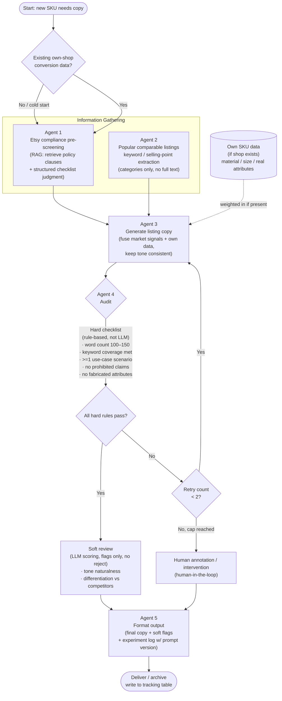

# Pingpin — Etsy Multi-Agent Listing System

A multi-agent pipeline for generating Etsy listing copy, built as **Condition C** of a controlled experiment testing whether AI assistance improves listing performance for non-native-English Etsy sellers.

> **Status: in progress.** Agents 1–4 are implemented, and all four are now wired into a single compiled LangGraph workflow (`main.py`). Agent 5 is designed (see diagram) and will be added next. A1's compliance node still needs its LLM-tool loop filled in before the graph can run end-to-end.

## Background

Most Etsy copywriting tools assume the seller already understands the platform's rules around what counts as "handmade," "designed by," or "curated" — and assume English fluency. Non-native-English sellers sourcing finished goods (e.g. from wholesale markets) often don't know these distinctions exist until a listing gets flagged.

This project treats that as the first problem to solve, not an edge case: before any copy gets generated, the system checks whether the *selling concept itself* is compliant with Etsy's seller policies — based on Etsy's actual published Creativity Standards, not assumptions.

## Experiment context

This pipeline is one of three conditions in a live A/B/C test run on a real Etsy shop:

| Condition | Approach |
|---|---|
| A | Fully human-written copy (baseline) |
| B | LangChain + Ollama batch generation, fixed prompt template |
| C | **This repo** — stateful LangGraph multi-agent system with compliance pre-screening, market-signal synthesis, and a hybrid (rule-based + LLM) critic loop |

Primary metric: favorites rate, compared across conditions with significance testing (scipy.stats).

## Architecture

Five-agent pipeline, diagrammed before any code was written.

> **Note:** the mermaid diagram below predates the current architecture and is pending an update. It still shows an early version of Agent 1 and an Agent 2 focused on scraping market trends. The current design (RAG-based compliance pre-screening for A1; manual-paste quality-gate + structured extraction for A2) is reflected in the agent table and per-agent sections beneath it.



| Agent | Role | Status |
|---|---|---|
| **Agent 1** | Etsy compliance pre-screening (RAG over Etsy seller policy docs + structured checklist judgment) | 🟡 Retriever built; `compliance_node` LLM-tool loop pending |
| **Agent 2** | Quality gate + structured SEO signal extraction from manually-pasted competitor listings (sanitize noise → extract deduplicated keywords / selling points via a Pydantic contract). Manual paste, not scraped — Etsy's ToS prohibits automated collection for AI use. | ✅ Implemented |
| **Agent 3** | Drafting agent — fuses A2 market signals + own sales data + tone into a title/description, with a feedback-aware retry loop driven by A4's audit results | ✅ Implemented |
| **Agent 4** | Two-layer critic — Python hard-gate (pass/fail) before LLM soft-scoring (0–20) on tone, selling points, naturalness, differentiation | ✅ Implemented |
| Agent 5 | Formats and archives final output + experiment log | 🔲 Planned |

## Agent 1 — Compliance Pre-Screening

Etsy requires every listing to be filed under one of four categories (Made by a Seller / Designed by a Seller / Sourced by a Seller / Curated set of purchased goods), each with different requirements. Agent 1 checks a seller's product concept against this before any copy is generated.

**Pipeline:**
1. Loads Etsy seller policy documents (PDF) from a local policy folder
2. Tags each chunk with a category (`Seller_Standards`, `Production_Partners`, `Shop_Policies`, `General_Help`) based on source filename
3. Splits and embeds into a Chroma vector store (`nomic-embed-text` via Ollama)
4. Exposes a `retriever_tool` that the agent calls to ground its compliance judgment in retrieved policy text — rather than guessing from the model's own (often outdated or hallucinated) sense of platform rules

**Design choice — why retrieval is split from judgment:** the retriever's only job is to report what it found (or honestly report that it found nothing). The actual compliance verdict is deliberately *not* decided by free-text LLM judgment alone — local models (this runs on `qwen2.5:7b` via Ollama) tend to hedge or contradict themselves on open-ended questions. The verdict is structured as a category classification step followed by a fixed per-category checklist, so the model's output is auditable rather than a vague paragraph.

**Status note:** the retriever and `retriever_tool` are built, but the `compliance_node` graph node (LLM call + tool loop + write of `is_compliance` / `system_feedback` into state) is not yet implemented — that's the last piece before the graph can run end-to-end.

**Model:** `qwen2.5:7b` (Ollama, local — chosen for reproducibility and zero API cost during development)

## Agent 2 — Quality Gate + SEO Signal Extraction

Users paste competitor listing text that is often noisy — marketing fluff, social links, malformed or poorly structured fragments. Passing that raw text to Agent 3 would degrade the generated copy ("garbage in, garbage out"). Agent 2's job is to **sanitize first, then extract**, so only clean, structured signals reach the generation stage.

**Design choice — structured output over manual `if`-gates:** rather than hard-coding rules to strip specific words (unmaintainable, and prone to over-stripping high-value modifiers like "Personalized"), the agent uses an LLM constrained by a Pydantic contract (`CompetitorSignal`) to do semantic categorization. The contract forces clean, typed output instead of free text:

- `is_valid: bool` — quality gate; noise / no product attributes → `False`
- `keywords: List[str]` — deduplicated
- `selling_points: List[str]` — material, size, use-case
- `reasoning: str` — audit trail for why the input passed or failed

**Design choice — no vector store for Agent 2:** competitor input is a single short pasted listing, not a corpus to search, so it goes straight into the LLM's context window. ChromaDB is reserved for Agent 1's actual retrieval use case (hundreds of policy pages).

**Data priority rule:** when both own-shop historical conversion data and competitor data exist, own data is treated as ground truth and takes priority; competitor data is treated as a (speculative) market signal. Agent 3 consumes `keyword_list` / `selling_point` / `seo_metadata` from state with this weighting in mind.

**Model:** `qwen2.5:7b` (Ollama, local)

## Agent 3 — Drafting Agent (with feedback loop)

Agent 3 is where every upstream signal converges into an actual `title` + `description`. It reads A2's cleaned keywords/selling points, the user's own sales data (if any), the tone preference, and the Etsy constraints, then synthesizes the copy.

**Design choice — one base prompt + conditional append, not two prompts.** The standard the copy must meet (Etsy rules, word count, keyword coverage) is *identical* on the first pass and on a retry — what changes is the material on hand, not the strictness. So `construct_draft_prompt` maintains one base prompt (rules + tone + signals, written once) and, only when `retry_count >= 1`, appends a feedback block: the previous draft plus A4's `system_feedback`, with an instruction to revise the flagged parts. This keeps the Etsy-rules block in a single place (single source of truth) instead of duplicated across two prompts.

**Design choice — state is the memory, so A1/A2 never re-run.** When A4 rejects a draft and routes back to A3, A3 simply re-reads `keyword_list` / `selling_point` / etc. — they're still sitting in shared state from the original A2 run. The retry edge is `A4 → A3`, not `A4 → A1`, so a revision costs one A3 call, not a full pipeline re-execution. No separate memory mechanism is needed.

**Design choice — structured output + regex split.** A Pydantic `BaseModel` plus `re` cleanly separates the title and description into distinct fields, and XML-tagged prompt structure guides the local model toward parseable, robust output rather than one undifferentiated blob.

**Tone handling:** if the user supplied a `tone_preference`, it's folded into the prompt; if left blank, the LLM self-determines a market-appropriate tone. Which branch runs is decided in Python, not left to the model.

**Model:** `qwen2.5:7b` (Ollama, local)

## Agent 4 — Two-Layer Audit (hard gate + soft scoring)

Agent 4 decides whether A3's draft ships or gets sent back to revise. It runs in two layers, cheapest and most reliable first.

**Layer 1 — hard gate (pure Python, pass/fail, no LLM).** `check_hard_rules()` checks the objective, deterministic things: description word count (100–150), a banned-word blacklist match, and presence of at least one use-case signal. Any failure rejects the draft immediately — it never reaches the LLM. Running deterministic checks in Python (not via the model) avoids the false negatives a local model would introduce on objective rules.

**Layer 2 — soft scoring (LLM, only after the hard gate passes).** An `AuditResult` Pydantic contract carries only the subjective dimensions the LLM is responsible for — `tone_match`, `selling_points`, `naturalness`, `differentiation` (each 0–5), a total `score` /20, and `feedback_points`. Hard-gate results are deliberately **not** part of `AuditResult`; they belong to Python's path.

**Design choice — the pass/fail threshold is Python's call, not the LLM's.** The model only scores; whether `score < 12` counts as a fail is decided with a plain `if` in `audit_node`. "How many points is a fail" is a deterministic rule, so it shouldn't be left to a probabilistic model — the same reasoning that keeps the hard gate in Python.

**Design choice — rules live in `audit_config.py`, not in the function.** `BANNED_WORDS`, `USE_CASE_SIGNALS`, and the word-count bounds are config constants, separated from logic so a rule change never touches code. The intended maintenance loop: rejected cases get logged → reviewed by a human → confirmed rules added to the config. The blacklist is kept deliberately narrow — context-dependent words like "best"/"authentic" are left for the LLM layer to judge, to avoid false positives on legitimate copy.

**On reject**, `audit_node` increments `retry_count` and writes the reason into `system_feedback` for A3 to read on its next pass.

**Model:** `qwen2.5:7b` (Ollama, local)

## Graph wiring (`main.py`)

All four nodes are now compiled into one LangGraph workflow:

- **Entry:** `compliance_check`
- `compliance_check` → conditional edge on `is_compliance` (`True` → `seo_extraction`; `False` → `END`)
- `seo_extraction` → `listing_draft`
- `listing_draft` → `audit_node`
- `audit_node` → conditional edge (`Passed` → `END`; `retry_count < 2` → back to `listing_draft`; else → human intervention)

This closes the A3↔A4 revision loop. The graph compiles; it cannot run end-to-end yet because A1's `compliance_node` is still a stub.

## Tech stack

- LangGraph / LangChain — agent orchestration
- Ollama (`qwen2.5:7b`, `nomic-embed-text`) — local inference + embeddings
- Pydantic — structured-output contracts for agent I/O
- ChromaDB — vector store (Agent 1 only)
- Python (`re` for title/description parsing)

## Setup

```bash
pip install langgraph langchain langchain-ollama langchain-community langchain-chroma langchain-text-splitters python-dotenv pydantic
ollama pull qwen2.5:7b
ollama pull nomic-embed-text
```

Agent 1 currently expects Etsy policy PDFs in a local folder referenced by `folder_path` in `agents/a1_compliance_agent.py`. **This path is hardcoded to a personal machine right now — update it to a relative `./data/etsy_policy/` path (or an env var) before running elsewhere.**

## Known issues / next steps

**Agent 1 (last piece before end-to-end run)**
- [ ] Implement the `compliance_node` graph node (LLM call + tool loop + state write of `is_compliance` / `system_feedback`) — the retriever and `retriever_tool` exist, but nothing calls them yet. Reuse the `call_llm` / `take_action` / `should_continue` pattern already working in `RAG_Agent.py`.
- [ ] `folder_path` / `persist_directory` are hardcoded placeholder paths — replace with a relative path (`./data/etsy_policy/`) or env var
- [ ] Wrap A1's module-level setup (PDF load, splitting, Chroma build) in a function or `if __name__ == "__main__":` guard so importing it elsewhere doesn't re-run the whole ingestion

**Agent 4 (hardening)**
- [ ] Move `SOFT_THRESHOLD` into `audit_config.py` with the other rule constants
- [ ] Add keyword-coverage check to `check_hard_rules()` as a threshold (e.g. ≥80%), not all-or-nothing
- [ ] Add attribute-consistency check (draft vs SKU data) to the hard gate

**State / shared modules**
- [ ] `PinpingoState` must live in exactly one place (the shared state module) and be imported everywhere — no duplicate definitions
- [ ] Keep the state class name spelled consistently across all files and imports

**Run / verify**
- [ ] Confirm `compile()` runs clean (no unknown-node / dead-end errors)
- [ ] Add an `invoke()` entrypoint to `main.py`, then run one test input end-to-end across all four nodes

**Docs**
- [ ] Update the mermaid diagram to match the current A1 (RAG compliance) / A2 (quality-gate extraction) design

## Project context

Part of a larger experiment comparing human-written, pipeline-generated, and agent-generated Etsy listing copy. Full experimental design, pricing/COGS analysis, and compliance research are documented separately as part of the broader portfolio project.
